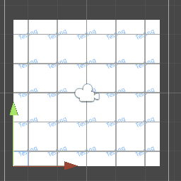
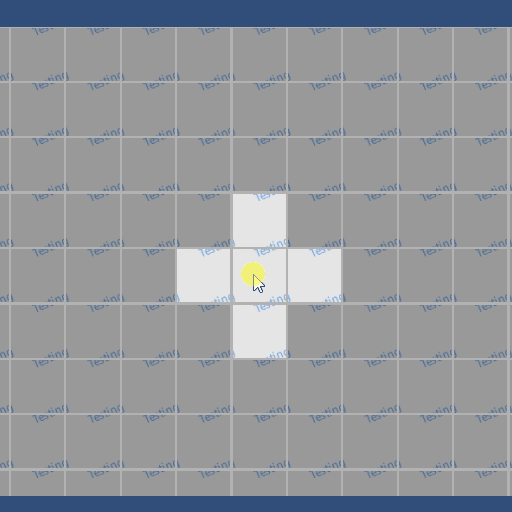

# Unity World Space Selectable Grid Shader

A worldspace 2D grid shader whose cells are selectable by mouse click.

Unity Version: 2021.3.20f1c1

## Showcase

## Test

For your texture import setting, set `Sprite Mode - Mesh Type = Full Rect`, `Advanced - Wrap Mode = Repeat`.

For sprite render, set `Draw Mode = Tiled`, then you can set `Draw Mode - Size` to tile your sprite.

Attach script `Playground.cs` to your sprite, then you can set `Playground - tintRadius` in editor.

Run the game, if you set `Playground - tintRadius = 1`, when you click the screen the first time, you will select 5 cells, centerd at where you click; the second time you click the screen, it means that you cancel the selection, and the image will return origin color.

Both shader and script are simple to read.

## Usage

It can be used in puzzle or strategy games using checkerboard maps.
